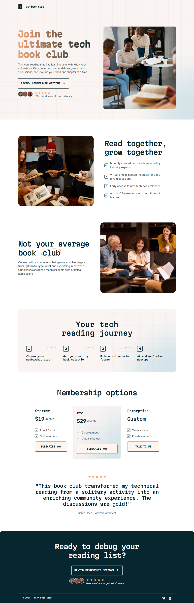
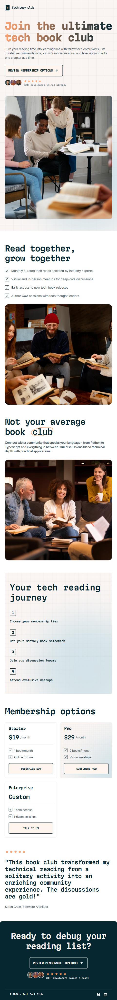
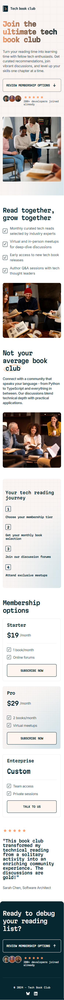

<p align="center">
  
</p>

<h1 align="center">Tech Book Club Landing Page</h1>

<p align="center">
  <strong>A responsive landing page for a fictional tech book club, built with semantic HTML and modern CSS.
  </strong>
</p>

<p align="center">
  🌐 <a href="https://codecove01-netizen.github.io/Tech-Book-Club-Landing-Page/"><strong>Live Demo</strong></a>
  &nbsp;|&nbsp;
  📂 <a href="https://github.com/codecove01-netizen/Tech-Book-Club-Landing-Page"><strong>Source Code</strong></a>
  &nbsp;|&nbsp;
  🎯 <a href="https://www.frontendmentor.io/challenges/tech-book-club-landing-page-fZQidjHU73"><strong>Challenge</strong></a>
</p>

---


## **📸 Layout Overview**

<table>
  <tr>
    <th align="center">💻 Desktop View</th>
    <th align="center">📱 Tablet View</th>
    <th align="center">📱 Mobile View</th>
  </tr>

  <tr valign="top">
    <td align="center">
      
    </td>
    <td align="center">
      
    </td>
    <td align="center">
      
    </td>
  </tr>
</table>

---


## 🚀 Built With
- **HTML5** — Semantic structure and accessible markup
- **CSS3** — Styling, responsive layouts, and visual effects
- **CSS Grid** — Page-level and multi-column layouts
- **Flexbox** — Component alignment and content positioning
- **CSS Custom Properties** — Reusable design values
- **Responsive Images** — Adaptive images using the `<picture>` element
- **Media Queries** — Responsive layouts across different screen sizes
- **CSS Logical Properties** — Flexible properties such as `padding-inline` and `margin-block`
- **JavaScript** — Interactive subscription toast notification
---


## **🛠️ Key Implementation Details**

- Used **semantic HTML5** to structure the page into meaningful sections.
- Created reusable **CSS custom properties** for colors, typography, spacing, and gradients.
- Used **CSS Grid** for larger page layouts and multi-column sections.
- Used **Flexbox** for component-level alignment and positioning.
- Followed a **mobile-first responsive workflow**.
- Used the `<picture>` element to serve different image assets for mobile, tablet, and desktop.
- Used **logical CSS properties** such as `padding-inline`, `margin-block`, and `max-inline-size`.
- Added responsive decorative patterns and background effects.
- Added `:hover` and `:focus-visible` states for interactive elements.
- Added JavaScript functionality to display a temporary success toast when the **"Subscribe now"** button is clicked.

---

## **💡 What I Learned**

- Practiced combining **CSS Grid** and **Flexbox**, using Grid for the overall page structure and Flexbox for aligning content within individual components.

```css
.read-grid {
    display: grid;
    grid-template-columns: 35rem 33.13rem;
    grid-template-areas:
        'read-image read-list';
    align-items: center;
    gap: var(--spacing-1000);
}

.container,.hero-section,.rating-container{
    display:flex;
    flex-direction: column;
}
```
- Gained more experience using the `<picture>` **element** to serve different image assets depending on the viewport size. 

```css
<picture class="hero-image-section">
    <source
        media="(min-width: 64rem)"
        srcset="./images/image-hero-desktop.webp">

    <source
        media="(min-width: 48rem)"
        srcset="./images/image-hero-tablet.webp">

    
</picture>
```
-	Improved my understanding of **CSS Custom Properties** by creating reusable variables for spacing, typography, colors, gradients, and font weights. 
```css
:root {
    --spacing-100: 0.5rem;
    --spacing-200: 1rem;
    --spacing-400: 2rem;
    --spacing-800: 4rem;
    --spacing-1200: 7.5rem;
}
```
- Continued practicing **CSS logical properties** such as `padding-inline`, `margin-block`, and `max-inline-size` instead of relying only on physical properties. 
```css
padding-inline: var(--spacing-400);
margin-block: var(--spacing-800);
max-inline-size: 100%;
```
-	Practiced positioning **decorative background patterns** and **glow effects** independently from the main content while adapting their position across responsive breakpoints. 

-	Improved my understanding of **interactive states** by using `:hover` and `:focus-visible` to provide clear feedback for buttons and links. 
```css
.review-btn:hover,
.review-btn:focus-visible {
    background: var(--linear-gradient-hover);
}
```
- Practiced using **JavaScript event listeners** to respond to user interactions and dynamically control UI states.

```javascript
subscribeBtn.addEventListener("click", () => {
    toast.classList.add("show");

    setTimeout(() => {
        toast.classList.remove("show");
    }, 3000);
});
```
---


## 📱 Responsive Design
The page follows a **mobile-first approach** and progressively enhances the layout at larger breakpoints.

### Mobile
- Stacked content and single-column layouts
- Mobile-specific responsive images
- Compact spacing and typography
- Touch-friendly interactive elements

### Tablet
- At 48rem, the layout expands to make better use of the available space, including wider content areas and multi-column components.
```css
@media screen and (min-width: 48rem) {
    .option-grid {
        display: grid;
        grid-template-areas:
            'option-card pro-card'
            'last-option-card .';
    }
}
```
### Desktop
- At 75rem, the layout transitions to a wider multi-column structure with larger content areas and more precise positioning.
```css
@media screen and (min-width: 75rem) {
    .hero-grid {
        display: grid;
        grid-template-columns: 35.63rem 33.75rem;
        gap: var(--spacing-800);
        align-items: center;
    }
}
```
---


## 🎯 The Challenge
The goal was to build the **Tech Book Club landing page** as closely as possible to the provided Frontend Mentor design.

The implementation needed to:

- View the optimal layout for the interface depending on the user's device screen size.
- See hover and focus states for all interactive elements on the page.
- Display a toast message or other success message when **"Subscribe now"** is clicked.

---


## 🛠️ Tools Used
-	**Visual Studio Code** — Development 
-	**Google Chrome** — Testing and debugging 
-	**Prettier** — Code formatting 
-	**Git** — Version control 
-	**GitHub** — Repository management

  
---


## 📂 Project Structure

```text
Tech-Book-Club-Landing/
│
├── images/
│   ├── image-hero-desktop.webp
│   ├── image-hero-tablet.webp
│   ├── image-hero-mobile.webp
│   └── ...
│
├── css/
│   └── style.css
│
├── js/
│   └── script.js
│
├── index.html
└── README.md
```
---
  
   
<h2 align="left">🌐 Connect With Me</h2>
<p align="left">
  <a href="https://github.com/codecove01-netizen">
    
  </a>
&nbsp;&nbsp;
  <a href="https://www.linkedin.com/in/arati-dsa-313626136/">
    
  </a>
&nbsp;&nbsp;
  <a href="https://www.frontendmentor.io/profile/codecove01-netizen">
    
  </a>
</p>

---

## 🙏 Acknowledgments
Thanks to **Frontend Mentor** for providing practical challenges that help developers strengthen their frontend skills through hands-on learning.
